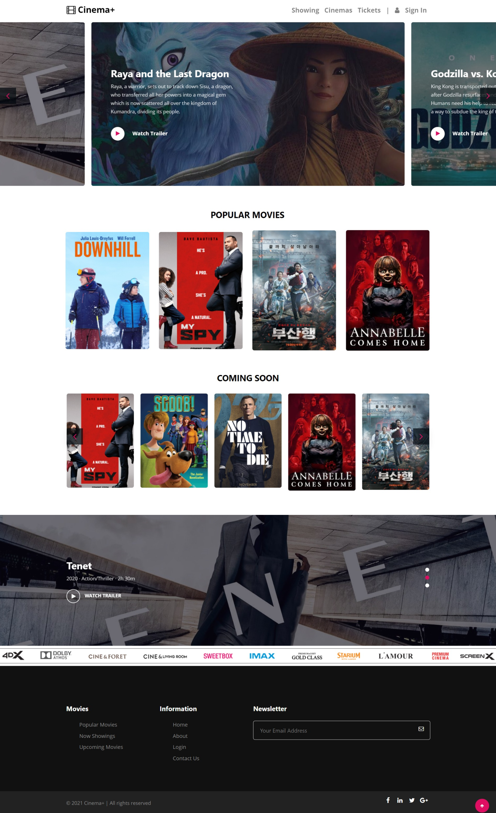

# Web Programming 2 Subject - Movie Tickets Booking Website Project
# Using: Node.js, Express.js, EJS Template, Postgres, CSS, Bootstrap 4, JavaScript, AJAX, JQuery

1. Homepage
- Banner
- Popular Movies
- Comming Soon

2. Users
- Register, forget password (Email verification)
- Login with Google/Facebook
- Information manage (booking history, change information)

3. Movies
- Watch trailers
- See movie details
- Book tickets

4. Cinemas
- Find movie showtimes by theater
- Theater and movie information (Address, movie trailer, director,..)

5. Booking
- Select and confirm movie information
- Send booking information via email

6. Admin
- Revenue statistics
- Movies, theaters, and showtimes management (add, delete, edit)

# Screenshots

